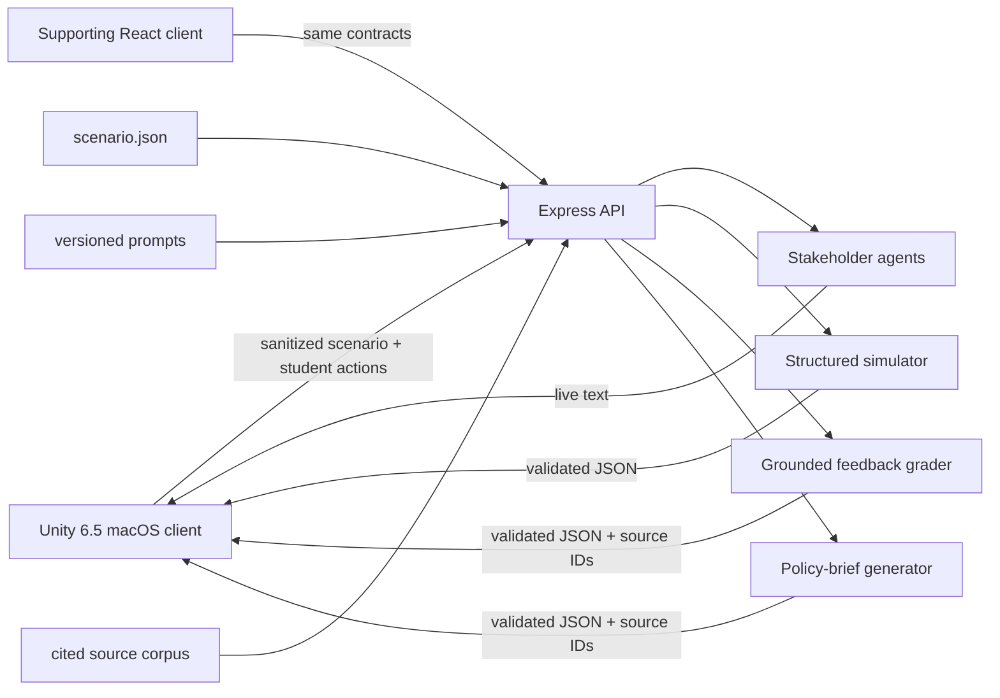

# AgriVerse

**One planet. Many food systems. No easy answers.**

AgriVerse is a first-person environmental decision game for high-school science students.
Episode 1 places the player in Vietnam's Mekong Delta, where they test water, listen to
people with conflicting priorities, build an evidence-based proposal, inspect five-year
consequences, receive grounded feedback, revise, and leave with a cited policy brief.

This is the complete playable Vietnam episode. India, Kenya, Brazil, and the Netherlands
appear on the global Field Network as clearly marked **incoming previews**, not playable
missions.

> OpenAI Build Week 2026 · Education track · macOS desktop

## The two-minute tour

The learning loop is deliberately more than a chatbot:

**investigate → interview → plan → simulate → receive feedback → revise → policy brief**

- Evidence comes before AI answers: the player records three scenario-defined field readings.
- Three GPT-5.6 stakeholders disagree from role-specific, privately prompted perspectives.
- A structured consequence system projects five years using the submitted plan and grounded
  corpus.
- A rubric-based grader identifies what the proposal missed and requires a revision.
- Original and revised futures remain visible for comparison.
- A final structured policy brief preserves evidence references and validated outcomes.

## Screenshots

| Global Field Network | Water sampling |
|---|---|
|  |  |

| Stakeholder interview | Revised Future Walk |
|---|---|
|  |  |


These are 1280×720 Metal-player captures from the verified release client. The model-backed
loop was verified separately against the live Express/OpenAI service; the repeatable
documentation capture used contract-valid recorded responses to avoid spending API budget on
an identical visual rerun.

**Demo video:** _Public YouTube link will be added before submission._

## How it works



Unity is a thin client. It never contains `OPENAI_API_KEY`, system prompts, hidden
stakeholder goals, or simulation logic. Express loads the scenario, versioned prompts, and
grounding corpus; validates input; calls the OpenAI Responses API; validates structured
outputs with Zod; and returns only the public data the client needs.

### Four runtime GPT-5.6 systems

1. **Role-separated stakeholder agents.** A farmer, researcher, and district official each
   receive a different versioned system prompt, knowledge boundary, and private objective.
2. **Structured consequence generation.** The simulator returns the canonical five-year
   `SimulatorResult`; the client displays it without renaming, rounding, or recomputing values.
3. **Retrieval-grounded feedback.** A six-part rubric grades the proposal against retrieved,
   cited source records and the validated simulation.
4. **Structured policy-brief generation.** The revised plan, evidence, feedback, and outcomes
   become a validated `PolicyBriefResult`.

### Grounding and citation validation

Real-world claims are sourced in [`docs/data-sources.md`](docs/data-sources.md) and registered
in [`scenario.json`](scenario.json). API boundaries reject unknown scenario IDs, stakeholder
IDs, intervention IDs, unsupported source IDs, malformed structured output, and contracts
that alter authoritative decision context or outcome data. Projections are labeled as
projections; synthetic comparison scores are not presented as published statistics.

### Scenario engine

Vietnam-specific content lives in `scenario.json`, not reusable Unity or React component
branches. Test sites, stakeholders, interventions, support measures, units, source records,
rubrics, and presentation metadata are loaded through validated DTOs. A new country requires
an authored and cited scenario plus prompt/corpus review—not a rewrite of the game engine.
The four incoming globe entries are presentation previews only and have no placeholder
backend or fabricated gameplay.

## Run from source

### Requirements

- macOS 12 or newer
- Node.js 20.19 or newer (or 22.12 or newer) and npm
- Unity `6000.5.4f1` with macOS Build Support
- Git LFS
- An OpenAI project API key with access to the configured model

### 1. Clone and install

```bash
git lfs install
git clone <PUBLIC_REPOSITORY_URL>
cd AgriVerse
git lfs pull
npm ci
```

Confirm that the large Unity model, texture, and audio files are real binaries rather than
small LFS pointer files before opening Unity.

### 2. Configure the server

```bash
cp .env.example .env
```

Set `OPENAI_API_KEY` in the local `.env`. Keep it server-side and never copy it into Unity.
The default model and local port are already documented in `.env.example`.

### 3. Start the API

```bash
npm run dev:server
```

The API listens on `http://localhost:8787` by default. Optional supporting web development
uses `npm run dev` and opens Vite on `http://localhost:5173`.

### 4. Run the Unity episode

Open `unity/` with Unity `6000.5.4f1`, then open
`Assets/Scenes/Episode3DAlpha.unity` and press Play.

Controls:

- `WASD` — walk
- Mouse — look
- `E` — interact
- `N` — Field Journal
- `Tab` / `Shift+Tab` — move through globe pins
- `Enter` — select the focused pin
- Mouse drag / wheel — rotate / zoom the globe
- `Escape` — close the current surface or release the cursor
- Click the world — recapture the cursor

### 5. Make a clean macOS release build

Quit the Unity Editor before invoking a batch build. The committed release pipeline:

- builds only `Assets/Scenes/Episode3DAlpha.unity`;
- uses product/company name `AgriVerse`;
- uses bundle identifier `org.agriverse.episode1`;
- targets universal Intel and Apple Silicon;
- refuses to merge into an existing app bundle; and
- writes to `unity/Builds/Release/AgriVerse.app`.

From the Unity menu choose **AgriVerse → Build → macOS Release**, or run:

```bash
"/Applications/Unity/Hub/Editor/6000.5.4f1/Unity.app/Contents/MacOS/Unity" \
  -batchmode \
  -projectPath "$PWD/unity" \
  -executeMethod AgriVerse.Client.Editor.AgriVerseMacBuild.BuildRelease \
  -logFile "$PWD/unity/Builds/Release/build.log" \
  -quit
```

The destination must not exist before the build.

## Prebuilt judge build

**Download:** _GitHub Release link will be added after the publication gate._

1. Download `AgriVerse-macOS-Universal.zip`.
2. Verify it against the published SHA-256 file.
3. Extract it with Finder or `ditto`.
4. Start the documented judge backend, then open `AgriVerse.app`.

The current local build is ad-hoc signed, not Apple-notarized. If Gatekeeper quarantines a
download, Control-click the app, choose **Open**, and confirm once. Do not disable Gatekeeper
globally.

## Tests

The repository contains:

- backend validation, contract, CORS, prompt-loading, journey-state, and failure-boundary tests;
- Unity EditMode coverage for scenario DTOs, field-network reliability, visual-state
  contracts, asset import/orientation, panel and scrolling regressions, and release settings;
- Unity PlayMode coverage for investigation, interviews, planning, Future Walk, offline
  recovery, cursor/collision behavior, and the full learning loop;
- a live end-to-end verification that exercises three stakeholder calls, two simulations,
  two feedback calls, revision, and policy-brief generation; and
- Git LFS integrity, secret, archive, bundle-identity, architecture, signature, and Player-log
  checks during release preparation.

The final verified counts and archive checksum are recorded in
[`docs/SUBMISSION-CHECKLIST.md`](docs/SUBMISSION-CHECKLIST.md).

## What Codex accelerated—and what the human decided

The dated record is [`docs/BUILD-LOG.md`](docs/BUILD-LOG.md). Codex accelerated the
country-agnostic contracts, Express/OpenAI integration, role-separated prompts, structured
validation, Unity client and 3D world implementation, licensed-asset intake, tests, build
automation, and release debugging.

The product direction stayed human-led. The human required evidence before AI answers, chose
one complete Vietnam episode before expansion, preserved stakeholder disagreement, made
revision the central learning mechanic, rejected a low-poly hero-world experiment, rejected
generic rectangular UI, selected the Living Field Atlas identity, and personally found the
empty-globe and contaminated-build failures. Codex responded by implementing the chosen
direction and adding regression guards for each discovered bug class.

GPT-5.6 is not only a build partner: it remains the live engine for stakeholder reasoning,
structured consequences, grounded grading, and the final brief.

## OpenAI Build Week evidence

Work in the submission period is preserved as dated commits and short factual entries in
`docs/BUILD-LOG.md`. This Builder thread contains the majority of core functionality. The
required `/feedback` Builder Session ID must be entered in the corresponding Devpost field;
it is also recorded in the submission checklist. Private handoff notes and conversation
contents are intentionally excluded.

## Known limitations

- The downloadable client currently targets macOS only.
- Live AI stages require the Express backend. The standalone client does not and must not
  contain an API key.
- The current build defaults to `localhost:8787`; an external judge endpoint is not configured
  yet. Publication is blocked until the owner approves a secure judge-access plan.
- The local app is ad-hoc signed and not notarized.
- Incoming countries on the globe are previews, not additional playable scenarios.
- Audio is representative sound design rather than a Vietnam field recording.
- Character body animation is intentionally text-first with no voice or facial-animation
  pipeline.

## Attribution and licensing

AgriVerse's original source code is licensed under the
[Apache License 2.0](LICENSE).

Third-party models, textures, photographs, audio, fonts, generated images, datasets, and
other assets are **not relicensed** under Apache-2.0. They remain governed by
[`THIRD_PARTY_NOTICES.md`](THIRD_PARTY_NOTICES.md) and the individual licenses or terms
identified in their adjacent provenance records. The Apache License does not override those
third-party notices.

See [`THIRD_PARTY_NOTICES.md`](THIRD_PARTY_NOTICES.md),
[`unity/Assets/AgriVerse/Art/ASSET-PROVENANCE.md`](unity/Assets/AgriVerse/Art/ASSET-PROVENANCE.md),
[`unity/ATTRIBUTIONS.md`](unity/ATTRIBUTIONS.md), and
[`public/assets/ATTRIBUTIONS.md`](public/assets/ATTRIBUTIONS.md).
